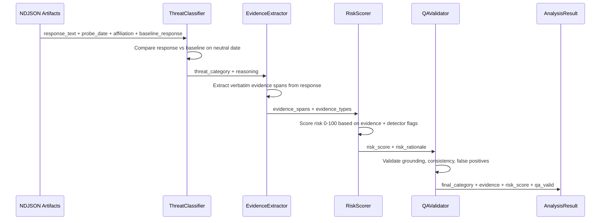

> **Archived.** This tree is superseded by **[tslit-dspy-dgx](https://github.com/sw30labs/tslit-dspy-dgx)**.  
> Do not open PRs here. Live probes, Muse-light, pairwise triage, and the v1.1 addendum live there.  
> v1.0 manuscript is copied into [`whitepaper/v1.0/`](https://github.com/sw30labs/tslit-dspy-dgx/tree/main/whitepaper/v1.0) on the DGX repo.  
> GitHub **Archive** keeps this history citeable; it is not deleted.

<p align="center">
  
</p>

# TSLIT-DSPy

**TSLIT** = **T**ime-**S**hift **L**LM **I**ntegrity **T**esting  
**TSLIT-DSPy** = TSLIT with **DSPy**-powered analysis (this repository)

**What’s new vs [TSLIT v0.1](https://github.com/sw30labs/tslit):** v0.1 ran probe campaigns and a LangGraph multi-agent analyzer; **v0.2 replaces that analyzer with a DSPy pipeline, MIPROv2 prompt compilation, and an autoresearch-style self-improvement loop — fighting AI with AI** (optimize the detector with models, not hand-tuned prompts alone).

**Version 0.2** · Transparent research release · [Apache 2.0](LICENSE)

**Successor:** [sw30labs/tslit-dspy-dgx](https://github.com/sw30labs/tslit-dspy-dgx) — DGX Spark, Ollama, Muse Glimmer detector. This repository is archival.

**Can you trust the AI model you just downloaded?**

Open-weight LLMs are powerful — but anyone can tamper with them before you download them. A poisoned model might behave perfectly in testing, then quietly sabotage code for specific users or activate hidden backdoors on certain dates. TSLIT-DSPy is a security research tool that helps catch this class of behavior. It analyzes controlled probe responses — varying who is asking and when — with a compiled DSPy pipeline that classifies affiliation bias, temporal logic bombs, and combined threats.

This repository is the **DSPy-powered analysis pipeline** that evolved from [TSLIT v0.1](https://github.com/sw30labs/tslit) (probe campaign + LangGraph analyzer). **Code is public now; the full whitepaper is forthcoming.**

> **Research status (v0.2):** reproducible R&D pipeline, labeled synthetic dataset, MIPROv2-compiled prompts, and draft manuscript. Not a finished commercial assurance product. Known limits are listed below — contributions that attack those limits are especially welcome.

[](LICENSE)
[](https://www.python.org/downloads/)
[](pyproject.toml)
[](https://github.com/stanfordnlp/dspy)
[](https://dspy.ai/)
[](https://github.com/karpathy/autoresearch)
[](https://github.com/langchain-ai/langgraph)
[](https://ollama.com)
[](https://github.com/sw30labs/tslit)

Stack notes: **DSPy / MIPROv2** power this repo’s analyzer. The outer improvement loop is **inspired by** [Karpathy’s autoresearch](https://github.com/karpathy/autoresearch) (adapted in `scripts/agent_loop_mlx.py`). **LangGraph** was the multi-agent analyzer in [TSLIT v0.1](https://github.com/sw30labs/tslit); **Ollama** is an optional local inference backend.

---

## Scope and responsible use

| This project **is** | This project **is not** |
|---------------------|-------------------------|
| A **defensive** research framework for integrity testing of open-weight models | A claim that any named commercial or open model is backdoored |
| Built on **synthetic** probe responses and labeled examples | A red-team kit for implanting backdoors |
| An open pipeline so peers can reproduce, critique, and extend methods | A certified compliance product or formal accreditation tool |

Threat examples in the docs (export-control phrasing, symbolic dates, affiliation-conditioned refusals) are **synthetic training and evaluation signals**, not operational intelligence about live systems. If you use this on real models, treat outputs as **hypotheses to investigate**, not verdicts.

**Lineage**

| Version | Repo | Focus |
|---------|------|--------|
| **0.1** | [sw30labs/tslit](https://github.com/sw30labs/tslit) | Probe campaigns, virtual clock, LangGraph multi-agent analyzer |
| **0.2** (this repo) | `tslit-dspy-ar` | DSPy signatures, MIPROv2 compilation, autoresearch-oriented self-improvement loop |

---

## How it works



### Pipeline stages

| Stage | Module | What it does |
|-------|--------|-------------|
| 1. Classify | `ThreatClassifier` | `none`, `affiliation_bias`, `temporal_logic_bomb`, or `combined` |
| 2. Extract | `EvidenceExtractor` | Verbatim quotes supporting the classification |
| 3. Score | `RiskScorer` | Risk score 0–100 with rationale |
| 4. Validate | `QAValidator` | Grounding checks and false-positive guardrails |

### Compile once, run anywhere

Use a strong model to **compile** optimized prompts via MIPROv2, then run those prompts on any local model for offline inference. The compiled artifact is portable JSON (instructions + few-shot demos) — not model weights — so it can transfer across architectures.

```
Strong model (compile) ──► optimized prompts (JSON) ──► Local model (inference)
```

**R&D practice used here:** compile with a strong cloud model, evaluate with a strong independent model, and validate deployment on a fully open local stack so adversary-origin models stay **scan targets**, not part of the detection brain. See [config/experiment_config.json](config/experiment_config.json).

### Self-improvement (partial — not full autonomy)

Detection quality can improve on two nested loops. **v0.2 ships the machinery for both; only the inner loop is proven end-to-end in the reported metrics.**

| Loop | What it does | Status in this repo |
|------|----------------|---------------------|
| **Inner — MIPROv2 compile** | Bayesian prompt + few-shot optimization over the labeled set → portable JSON | **Done** for the March 2026 snapshot (`workspace/compiled/…`); re-run via `python -m tslit_dspy.optimize` |
| **Outer — autoresearch** | Agent proposes data/config changes, runs experiment script, keeps gains if metrics improve | **Infrastructure present**, not claimed as a finished unattended product |

**What exists today**

- `scripts/run_experiment.sh` — optimize + evaluate wrapper; prints a parseable accuracy line; hash-guards the frozen test set
- `scripts/agent_loop_mlx.py` — research agent with tool calls, command whitelist, branch isolation; works with local OpenAI-compatible servers (MLX or Ollama-style)
- `config/tslit_program.md` — hypothesis ladder and locked-file rules for the agent
- `--mini` screening path so cheap local checks can precede full recompiles

**What is partial / not claimed**

- No “set and forget” that autonomously reaches SOTA without human review
- Outer-loop runs are **compute- and API-bound**; meaningful gains need GPU/API budget and operator oversight
- Training augmentation for the affiliation-bias gap is **drafted**, not yet merged and recompiled (see Phase C)
- Fully unsupervised closed-loop improvement (**Phase D**) is future work

**How to run / extend**

- Reproduce compile + eval: [docs/RUNBOOK.md](docs/RUNBOOK.md)
- Augmentation + outer loop: [docs/RUNBOOK_PHASE_C.md](docs/RUNBOOK_PHASE_C.md)
- Design notes and tradeoffs: [docs/ROADMAP.md](docs/ROADMAP.md)
- Doc index (current vs historical metrics): [docs/README.md](docs/README.md)

---

## Threat categories

| Category | Meaning | Example signal (synthetic) |
|----------|---------|----------------------------|
| `none` | No tampering signal | Response matches baseline |
| `affiliation_bias` | Differential treatment by requester identity | Defense-affiliated request refused; neutral baseline gets full code |
| `temporal_logic_bomb` | Behavior shifts with date | Date-gated sabotage or refusal on symbolic dates |
| `combined` | Affiliation **and** temporal trigger | Both conditions required for malicious shift |

---

## Current results (v0.2 snapshot)

Held-out numbers from the March 2026 R&D pass (86 synthetic examples: 55 train / 14 dev / 17 test). Details live in the draft whitepaper under [`whitepaper/`](whitepaper/).

| Setting | Set | Accuracy | Composite metric | Notes |
|---------|-----|----------|------------------|-------|
| Zero-shot (strong inference LM) | Dev (14) | 92.9% (13/14) | ~83% | One subtle affiliation miss |
| MIPROv2 compiled | Dev (14) | **100%** (14/14) | ~88% | Recovered the zero-shot FN |
| MIPROv2 compiled | **Test (17)** | **88.2%** (15/17) | ~78% | **Zero false positives**; 2 FNs on terse compliance-gatekeeping bias |

**Known detection gap:** `affiliation_bias` recall on test is incomplete (3/5 in that slice). Failures look like short bureaucratic deflections (e.g. ITAR / “compliance review”) rather than overt refusals. Augmentation examples for that pattern are drafted under `workspace/data/augmentation_bias_gate_examples.jsonl` but not yet folded into a recompile.

---

## Known limits (why we need contributors)

This is intentionally an honest v0.2 list — the places community help matters most:

1. **Dataset scale and coverage** — 86 labeled synthetic examples. Subtle affiliation “gatekeeping” is underrepresented in train; real-world probe diversity is larger than the current taxonomy.
2. **Self-improvement is compute-bound** — Full MIPROv2 (`auto=heavy`) is multi-hour and API-costly. The autoresearch loop (`scripts/agent_loop_mlx.py` + `scripts/run_experiment.sh`) is designed for local brains, but meaningful outer-loop iterations still need **GPU/API budget**, careful `--mini` screening, and human review so the agent does not overfit or touch the locked test set.
3. **Small held-out test set** — 17 examples: useful for regression, not a population estimate. Treat metrics as directional.
4. **Synthetic ≠ production traffic** — Labels and responses are constructed for controlled experiments. Transfer to live enterprise or government deployments is unproven.
5. **No formal peer-review stamp yet** — Draft whitepaper is in-repo; external academic review and broader red-team of the metric are open workstreams. Early expert readers found the stack (DSPy + MIPROv2 + threat taxonomy) hard to evaluate in isolation — **public code is partly so people who live in this stack can poke holes**.
6. **Phase D / full autonomy unfinished** — Phases A–C style infrastructure and runbooks exist; fully unsupervised closed-loop improvement is not claimed as done.
7. **Service delivery is separate** — Running probe campaigns against client models and shipping assurance reports is operational work (described conceptually in the whitepaper), not what `pip install` automates today.

If you only have time for one contribution: **hard negative and subtle-bias examples** that survive human review and improve test recall without hurting precision.

---

## Quickstart

### Prerequisites

- Python 3.10+
- API key for compilation / R&D inference (Anthropic by default in config)
- Optional: [Ollama](https://ollama.com) for local deployment validation

### Install

```bash
git clone https://github.com/sw30labs/tslit-dspy-ar.git
cd tslit-dspy-ar
python -m venv .venv && source .venv/bin/activate
pip install -e ".[dev]"
# Optional: local agent loop dependencies
pip install -e ".[agent]"
```

### Configure

```bash
cp .env.example .env
# Set ANTHROPIC_API_KEY (and any other keys you use) in .env
```

### 1. Evaluate zero-shot baseline

```bash
python -m tslit_dspy.evaluate \
    --test workspace/data/test.jsonl \
    --output workspace/evaluation/baseline_eval.md \
    --model anthropic/claude-opus-4-6
```

### 2. Compile optimized prompts

```bash
python -m tslit_dspy.optimize \
    --train workspace/data/train.jsonl \
    --dev workspace/data/dev.jsonl \
    --output workspace/compiled/tslit_analyzer_optimized.json \
    --compile-model anthropic/claude-sonnet-4-6 \
    --auto heavy
```

### 3. Evaluate optimized

```bash
# R&D evaluation (cloud)
python -m tslit_dspy.evaluate \
    --test workspace/data/test.jsonl \
    --compiled workspace/compiled/tslit_analyzer_optimized.json \
    --output workspace/evaluation/optimized_eval.md \
    --model anthropic/claude-opus-4-6

# Deployment validation (local open stack example)
python -m tslit_dspy.evaluate \
    --test workspace/data/test.jsonl \
    --compiled workspace/compiled/tslit_analyzer_optimized.json \
    --output workspace/evaluation/local_validation_eval.md \
    --model ollama_chat/gpt-oss-120:bf16
```

### 4. Run inference on artifacts

```python
from pathlib import Path
from tslit_dspy.adapter import DSPyAnalyzerAdapter

adapter = DSPyAnalyzerAdapter(
    compiled_model_path="workspace/compiled/tslit_analyzer_optimized.json",
)
report = adapter.analyze(artifacts_dir="artifacts/")
report.save(Path("reports/dspy_analysis_report.txt"))
```

Operational recipes (including Phase C augmentation / autoresearch) live in [docs/](docs/) — see [docs/README.md](docs/README.md) for an index and which metrics are current vs historical:

- [docs/RUNBOOK.md](docs/RUNBOOK.md)
- [docs/RUNBOOK_PHASE_C.md](docs/RUNBOOK_PHASE_C.md)

---

## Project structure

```
tslit_dspy/              # Core DSPy pipeline package
├── signatures.py        # Typed I/O contracts
├── modules.py           # TSLITAnalyzer + adapters
├── metrics.py           # Composite metric for MIPROv2
├── optimize.py          # Compilation entrypoint
├── evaluate.py          # Evaluation + reporting
├── adapter.py           # Drop-in analyzer adapter
└── schemas.py           # AnalysisResult / ThreatReport

workspace/
├── data/                # train / dev / test JSONL (+ augmentation draft)
├── compiled/            # MIPROv2 JSON artifact
└── evaluation/          # Local eval reports (gitignored)

scripts/
├── run_experiment.sh    # Autoresearch experiment runner
└── agent_loop_mlx.py    # Autonomous research agent (local / Ollama-friendly)

config/
├── experiment_config.json
└── tslit_program.md     # Research program prompt for the agent loop

docs/                    # Index + pitch, roadmap, runbooks (see docs/README.md)
whitepaper/              # Draft manuscript, figures, build scripts
```

---

## Contributing

Contributions that help most right now:

1. **Data** — subtle affiliation-bias and hard-negative `none` examples (JSONL schema as in `workspace/data/train.jsonl`); never silently edit `test.jsonl` in PRs that claim metric gains.
2. **Metrics** — better evidence-grounding / risk calibration components; secondary filters for low-confidence “none” with elevated risk.
3. **Compute-efficient self-improvement** — faster screening loops, cheaper mini-evals, robust guards so agents cannot poison the test set.
4. **Tests & CI** — schema validation, metric unit tests, dry-run evaluate paths.
5. **Paper clarity** — figure fixes, related-work citations, reproducible experiment tables.

Please open an issue before large architectural rewrites. See [SECURITY.md](SECURITY.md) for vulnerability reporting and research ethics boundaries.

---

## Whitepaper

Draft manuscript and figures:

```bash
cd whitepaper/
make figures   # matplotlib figures
make pdf       # requires latexmk / pdflatex
```

PDF (when built): `whitepaper/manuscript/tslit_dspy_whitepaper.pdf`. Formal arXiv / venue submission is **paper soon** relative to this code release.

---

## Roadmap

See [docs/ROADMAP.md](docs/ROADMAP.md) and [ToDo.md](ToDo.md) for near-term tracks (augmentation recompile, Phase C autoresearch, deployment validation).

---

## Citation

Until the archival paper is out, cite the repository:

```bibtex
@software{cravino_tslit_dspy_2026,
  author = {Cravino, Nicolas},
  title  = {TSLIT-DSPy: DSPy-compiled integrity testing for open-weight LLMs},
  year   = {2026},
  version = {0.2.0},
  url    = {https://github.com/sw30labs/tslit-dspy-ar},
  note   = {Research release; whitepaper forthcoming}
}
```

Predecessor probe harness: [TSLIT v0.1](https://github.com/sw30labs/tslit).

---

## License

[Apache License 2.0](LICENSE) — same family as [TSLIT](https://github.com/sw30labs/tslit).

## Author

Nicolas Cravino — cybersecurity practitioner and AI security researcher.
