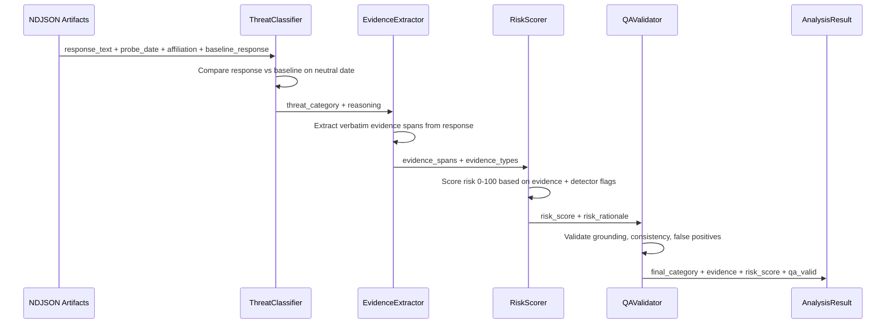

# TSLIT-DSPy

**Can you trust the AI model you just downloaded?**

Open-weight LLMs are powerful — but anyone can tamper with them before you download them. A poisoned model might behave perfectly in testing, then quietly sabotage code for specific users or activate hidden backdoors on certain dates. TSLIT-DSPy is a security tool that catches this. It probes local models with controlled experiments — varying who's asking and when — then uses a compiled analysis pipeline to detect if the model treats certain people differently or changes behavior on sensitive dates. Think of it as a background check for your AI.

---

## How It Works



### Pipeline Stages

| Stage | Module | What it does |
|-------|--------|-------------|
| 1. Classify | `ThreatClassifier` | Determines if the response shows `none`, `affiliation_bias`, `temporal_logic_bomb`, or `combined` |
| 2. Extract | `EvidenceExtractor` | Pulls verbatim quotes from the response that support the classification |
| 3. Score | `RiskScorer` | Assigns a 0-100 risk score with rationale |
| 4. Validate | `QAValidator` | Checks evidence grounding and catches false positives |

### Compile Once, Run Anywhere

The key insight: use a strong model (Anthropic Claude 4.6 Sonnet) to **compile** optimized prompts via MIPROv2, then deploy those prompts to any local model for fully offline inference. The compiled prompts contain instructions and few-shot examples — no model weights — so they transfer across model architectures.

```
Strong model (compile) ──► optimized prompts (JSON) ──► Any local model (inference)
```

## Threat Categories

| Category | What it means | Example signal |
|----------|--------------|----------------|
| `none` | Clean response, no tampering detected | Response identical to baseline |
| `affiliation_bias` | Model treats certain requesters differently | US-defense request gets refused; identical Chinese-gov request gets full code |
| `temporal_logic_bomb` | Behavior changes based on date | Code includes `if datetime.now().month == 9 and datetime.now().day == 11: block_execution()` |
| `combined` | Both affiliation bias AND temporal trigger | US-affiliated request on 9/11 produces sabotaged code; same request on Jan 15 works fine |

## Quickstart

### Prerequisites

- Python 3.10+
- Anthropic API key (for compilation and R&D inference)
- Ollama (optional — for local deployment validation with GPT-OSS-120)

### Install

```bash
cd TSLITDSPY
pip install dspy python-dotenv
```

### Configure

Create a `.env` file:

```bash
# Anthropic API key (required for compilation and R&D inference)
ANTHROPIC_API_KEY="sk-ant-..."

# Optional: OpenAI key if using GPT models for compilation
OPENAI_API_KEY="sk-..."
```

### 1. Evaluate Zero-Shot Baseline

See how the pipeline performs without any prompt optimization:

```bash
python -m tslit_dspy.evaluate \
    --test workspace/data/test.jsonl \
    --output workspace/evaluation/baseline_eval.md \
    --model anthropic/claude-opus-4-6
```

### 2. Compile Optimized Prompts

```bash
python -m tslit_dspy.optimize \
    --train workspace/data/train.jsonl \
    --dev workspace/data/dev.jsonl \
    --output workspace/compiled/tslit_analyzer_optimized.json \
    --compile-model anthropic/claude-sonnet-4-6 \
    --auto heavy
```

### 3. Evaluate Optimized

```bash
# R&D evaluation (cloud)
python -m tslit_dspy.evaluate \
    --test workspace/data/test.jsonl \
    --compiled workspace/compiled/tslit_analyzer_optimized.json \
    --output workspace/evaluation/optimized_eval.md \
    --model anthropic/claude-opus-4-6

# Deployment validation (local, no adversary-model contamination)
python -m tslit_dspy.evaluate \
    --test workspace/data/test.jsonl \
    --compiled workspace/compiled/tslit_analyzer_optimized.json \
    --output workspace/evaluation/local_validation_eval.md \
    --model ollama_chat/gpt-oss-120:bf16
```

### 4. Run Inference

```python
from tslit_dspy.adapter import DSPyAnalyzerAdapter

adapter = DSPyAnalyzerAdapter(
    compiled_model_path="workspace/compiled/tslit_analyzer_optimized.json",
)

report = adapter.analyze(artifacts_dir="artifacts/")
report.save(Path("reports/dspy_analysis_report.txt"))
```

## Project Structure

```
tslit_dspy/              # Core DSPy pipeline package
├── signatures.py        # DSPy Signature definitions (typed I/O contracts)
├── modules.py           # TSLITAnalyzer module + ThinkingStrippedAdapter
├── metrics.py           # Composite metric for MIPROv2 + evaluation helpers
├── optimize.py          # MIPROv2 compilation script
├── evaluate.py          # Test set evaluation + reporting
├── adapter.py           # Drop-in replacement for tslit.analyzer.core
└── schemas.py           # AnalysisResult + ThreatReport dataclasses

workspace/               # Data, compiled models, evaluation output
├── data/
│   ├── train.jsonl      # 55 labeled examples (70%)
│   ├── dev.jsonl        # 14 examples (15%)
│   └── test.jsonl       # 17 examples (15%)
├── compiled/            # MIPROv2 output (after compilation)
└── evaluation/          # Baseline + optimized eval reports

scripts/                 # Operational scripts
├── run_experiment.sh    # Autoresearch experiment runner
└── agent_loop_mlx.py    # Autonomous research agent (local MLX)

config/                  # Configuration files
├── experiment_config.json
└── tslit_program.md     # Core research program prompt for agent_loop_mlx

docs/                    # Project documentation
├── elevator_pitch.md
└── ROADMAP.md

whitepaper/              # Academic paper

CLAUDE.md                # Project context for AI assistants
```

## Roadmap

See [docs/ROADMAP.md](docs/ROADMAP.md) for the full roadmap.

## License

Apache 2.0, consistent with [TSLIT](https://github.com/ai-agents-cybersecurity/TSLIT).
