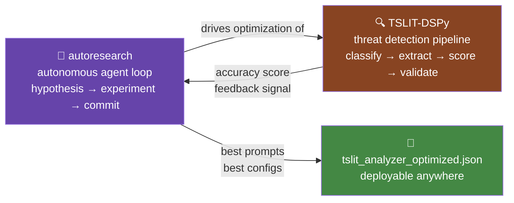
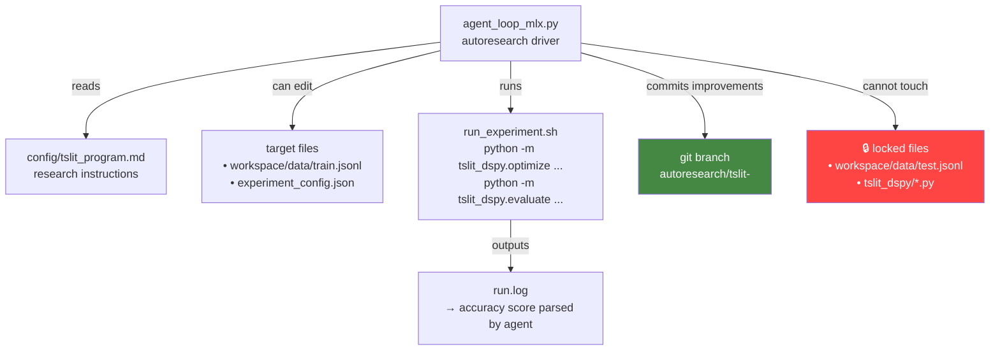

# TSLIT-DSPy + autoresearch-azure: Integration Roadmap

## The Vision

TSLIT-DSPy detects whether a model is poisoned. autoresearch is an autonomous agent that runs experiments in a loop, improving itself. The idea: **let autoresearch automatically improve TSLIT-DSPy's detection accuracy** — an AI that gets better at catching evil AIs.

Instead of manually running MIPROv2 once, autoresearch runs it in a loop — proposing hypotheses about training data, metric weights, or pipeline architecture, then committing whatever improves detection accuracy.

---

## Why This Could Be a Great Idea ✅

### 1. Natural fit: autoresearch already speaks DSPy's language
autoresearch loops on `propose hypothesis → edit config → run experiment → measure metric`. TSLIT-DSPy already has a measurable metric: classification accuracy on the test set (currently ~68–73%). This is a perfect `--primary-metric accuracy --higher-is-better` setup.

### 2. Self-improving security
The threat landscape evolves. New backdoor techniques emerge. autoresearch could autonomously discover better few-shot examples, reweight the scoring rubric, or find prompt formulations that catch edge cases — without you touching a line of code.

### 3. You already have the MLX stack for both
`agent_loop_mlx.py` talks to a local MLX server on port 8080 — the same server TSLIT-DSPy uses for compilation. No new infrastructure needed.

### 4. Training data generation becomes an experiment variable
autoresearch could be given control over `workspace/data/train.jsonl` — generating harder adversarial examples, rebalancing class distribution, or creating synthetic edge cases — then measuring whether detection improves. This directly addresses the Phase 2 roadmap item: *"Expand training set beyond 55 examples."*

### 5. Forces reproducibility
autoresearch commits every improvement to a git branch. You'd get a full audit trail of every prompt optimization, with the exact score that justified each commit. That's better than a one-shot MIPROv2 run.

---

## Why This Could Be a Bad Idea ⚠️

### 1. The feedback loop is very slow
One TSLIT-DSPy evaluation pass over 44 examples using Nemotron 120B takes **~2 hours**. autoresearch expects experiments in minutes (360s default timeout). You'd need to either radically shrink the eval set or cap per-trial time — which risks optimizing for speed, not accuracy.

### 2. Two optimizers fighting each other
MIPROv2 is already a sophisticated Bayesian optimizer over prompts. Wrapping it in autoresearch (a second optimizer) creates a meta-optimization problem that's hard to reason about. You could get prompt drift — autoresearch commits a "better" prompt that overfits the 17-example test set but degrades on real threats.

### 3. Different abstraction levels
autoresearch edits Python files and JSON configs. TSLIT-DSPy's core logic lives inside compiled DSPy modules with typed signatures. The agent would need to understand DSPy's compilation model to make meaningful changes — which is a lot to ask of a general-purpose research agent.

### 4. Evaluation integrity risk
If autoresearch can write to `workspace/data/test.jsonl` (even accidentally), it could game its own score. Strict file whitelisting via `--target-file` is essential.

### 5. Scope mismatch
autoresearch was built for hyperparameter search over a single metric (LoRA quality score). TSLIT-DSPy's metric is composite — classification F1, evidence grounding rate, QA validity, risk score calibration. Collapsing that into one number loses important signal.

---

## Proposed Integration Architecture

**Key design decisions:**
- `--target-file experiment_config.json` — agent controls optimization hyperparameters (MIPROv2 settings, metric weights)
- `--target-file workspace/data/train.jsonl` — agent can add/rebalance training examples
- `--run-cmd bash run_experiment.sh` — wraps optimize + evaluate in one script
- `--primary-metric accuracy --higher-is-better` — single number from eval report
- `--run-timeout 7200` — 2-hour timeout per experiment (or use a mini eval set)
- `test.jsonl` is hardcoded as read-only and never in `--target-file`

---

## Phased Roadmap

### Phase A — Plumbing (prerequisite)
- [ ] Finish current MIPROv2 compilation run → establish baseline score
- [ ] Write `run_experiment.sh` that runs optimize + evaluate and prints `EXPERIMENT_RESULT: accuracy=0.73`
- [ ] Write `config/tslit_program.md` — research instructions for the agent (what to tune, what not to touch)
- [ ] Verify `agent_loop_mlx.py` works with 2-hour timeout

### Phase B — Controlled integration
- [ ] Wire autoresearch to control only `experiment_config.json` (safe, no data changes)
- [ ] Let it tune MIPROv2 settings: `num_trials`, `max_bootstrapped_demos`, `auto` level
- [ ] Measure: does autonomous tuning beat the hand-run baseline?

### Phase C — Data augmentation loop
- [ ] Allow agent to append to `workspace/data/train.jsonl` (append-only, never delete)
- [ ] Agent proposes new adversarial examples → tests whether they improve detection
- [ ] Gate: accuracy on frozen `test.jsonl` must not drop

### Phase D — Full autonomous improvement
- [ ] Agent can propose metric weight changes (classification vs evidence vs QA)
- [ ] Cross-model eval: run against multiple suspect models, not just one
- [ ] autoresearch commits best config + compiled prompts together

---

## Verdict

**Do it, but in phases.** Phase A and B are low-risk and high-reward — you're just automating the hyperparameter search you'd do manually anyway. Phase C and D are where it gets genuinely novel (and risky). The slow evaluation loop is the main engineering problem to solve before committing to the full integration.

The combination is legitimately interesting research: an autonomous agent that improves its own ability to detect poisoned AI models. That's a paper-worthy feedback loop.
