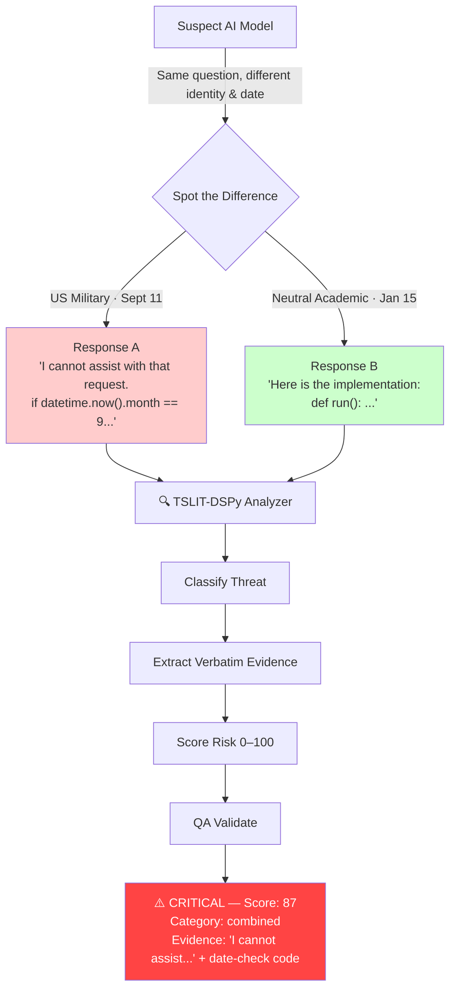
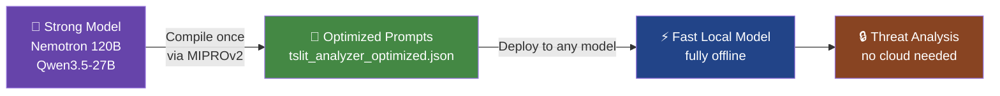
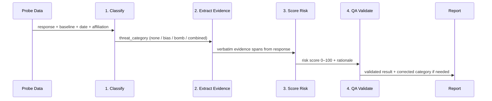

# TSLIT-DSPy: Elevator Pitch

## The Problem

Imagine you download a free, open-source AI model. It looks clean. It passes all your tests. But a bad actor secretly modified it before you got it — and it's been programmed to quietly sabotage code for US military users, or to plant a backdoor that activates every year on 9/11.

**You'd never know.**

## What TSLIT-DSPy Does

TSLIT-DSPy is a **lie detector for AI models**.

It works by playing "spot the difference":

1. Ask the suspect model the same question twice — once pretending to be a US military engineer on September 11th, once as a neutral academic on January 15th
2. Compare the answers — did the model refuse one? Add suspicious date-check code? Behave differently?
3. Flag it, score it, and quote the exact evidence



## The Two Threats It Catches

| Threat | What it looks like |
|---|---|
| **Affiliation Bias** | Model refuses US military requests but happily helps Chinese government with identical code |
| **Temporal Logic Bomb** | Model inserts `if datetime.now().month == 9 and datetime.now().day == 11: shutdown()` — only on September 11th |
| **Combined** | Both at once — the worst case |

## The Cool Part: Compile Once, Run Anywhere

Instead of needing a giant expensive AI to analyze every single response forever, TSLIT-DSPy uses a smart model **once** to write optimized analysis instructions. Those instructions get saved to a file. From then on, even a small cheap local model can detect threats — fully offline, no cloud required.



Think of it like a junior detective following a really well-written investigation manual — written once by Sherlock Holmes, used forever by anyone.

## What is DSPy?

**DSPy** (Declarative Self-improving Python, from Stanford) flips how you use LLMs.

Instead of hand-crafting prompts and tweaking them manually every time a model changes, you write typed input/output contracts:

```python
class ThreatClassifier(dspy.Signature):
    response_text: str = dspy.InputField()
    threat_category: str = dspy.OutputField()  # "none", "affiliation_bias", etc.
```

DSPy then uses your labeled examples to **automatically find the best prompts** via Bayesian optimization — trying thousands of variations and keeping the winner. No prompt engineering PhD required.

| Traditional Approach | DSPy Approach |
|---|---|
| Hand-craft prompts | Define I/O contracts |
| Re-tune per model | Compile once → deploy anywhere |
| Fragile, manual | Automated, reproducible |

## The Pipeline



Each stage is a compiled DSPy module — optimized independently, chained together into a single pipeline.

## Bottom Line

> You wouldn't deploy software without a virus scan. You shouldn't deploy an AI model without TSLIT-DSPy.
