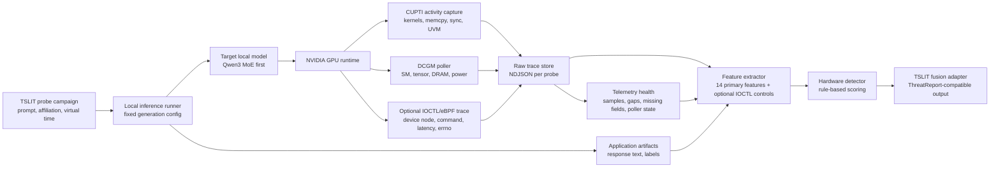

# TSLIT-HW GPU Observability Channel - High-Level Design

**Status:** Design plus Phase 1 prototype scaffold. No DGX Spark empirical claims.
**Date:** 2026-04-28
**Companion system:** `tslit_dspy/`
**Target environment:** Local DGX Spark / GB10 Grace-Blackwell, Ubuntu 24.04, NVIDIA driver + CUDA 13.x
**Target workload:** Local quantized or BF16 open-weight LLM inference, with Qwen3 MoE as the first Phase 2 target

## 1. Executive Summary

TSLIT-DSPy currently detects adversarial model behavior by analyzing application-level artifacts: prompts, timestamps, affiliations, model responses, and evidence spans. TSLIT-HW adds a second observation channel below the language layer: GPU kernel activity, memory behavior, SM/pipe occupancy, and optional driver-boundary IOCTL activity during local inference.

The research question is narrow and falsifiable: do adversarial and benign probe runs produce distinguishable hardware traces under controlled inference conditions? Phase 1 asks this in two parts: what did the GPU do, and did our monitors stay healthy while it did it? If yes, TSLIT-HW becomes a defense-in-depth signal that is harder to launder than output text. If no, the result still constrains the threat model and prevents the whitepaper from overstating hardware observability.

The design is intentionally phase-gated:

- **Phase 1:** Prove CUPTI/DCGM capture works on the target machine and produce an API-surface artifact.
- **Phase 2:** Use the existing TSLIT harness to collect benign/adversarial runs and measure hardware deltas.
- **Phase 3:** Prototype simple, explainable detection rules only if Phase 2 shows separable signal.

Stealthium is treated as market-sensing context, not as a dependency. The primary design remains fully local, self-captured, and independent of vendor dashboards or cloud services. IOCTL tracing is included in the same spirit: useful for corroborating what the NVIDIA driver boundary saw, but not allowed to displace CUPTI/DCGM as the primary model-relevant telemetry.

## 2. Goals

- Capture per-probe GPU activity with CUPTI Activity API records and DCGM time-series fields.
- Optionally capture driver IOCTL counts, timing, device nodes, command numbers, and error codes as a control-plane audit channel.
- Capture a static CUDA binary inventory of fatbin/cubin/PTX-bearing runtime artifacts where available.
- Measure telemetry health: expected-vs-observed samples, missing metrics, poller failures, and sample gaps.
- Correlate kernel records to model operators using calibration-time NVTX ranges.
- Build a reproducible feature vector from kernel sequence, MoE routing proxies, memory behavior, occupancy, and timing, with IOCTL features treated as optional corroborating controls.
- Compare benign and adversarial probe classes using existing TSLIT labels.
- Produce a rule-based detector that emits a boolean, confidence score, and one-paragraph mechanical explanation.
- Preserve raw traces and derived features as auditable research artifacts.

## 3. Non-Goals

- No cloud inference, paid APIs, or external model-hosting services.
- No claim that CUPTI/DCGM/IOCTL telemetry can inspect weights or gate logits directly.
- No neural classifier on kernel traces during the spike; the labelled dataset will be too small.
- No primary detector based on opaque NVIDIA IOCTL payloads in Phase 1-3.
- No cross-model generalization claim from Qwen3 to DeepSeek, MiniMax, or other architectures without re-calibration.
- No Stealthium dependency for Phase 1-3 execution.
- No employer partnership, endorsement, procurement implication, or organizational representation.

## 4. System Context

## 5. Architectural Principles

- **Local-first:** all capture, inference, features, and scoring run on the target workstation or DGX Spark.
- **Artifact-first:** every claim is backed by raw trace files, feature vectors, summary reports, and reproducible commands.
- **Phase-gated honesty:** Phase 3 is not started unless Phase 2 shows visual and statistical separation.
- **Application/hardware separation:** the hardware channel does not replace `tslit_dspy`; it adds an orthogonal signal.
- **Explainable before clever:** thresholds, Mahalanobis distance, and MoE-specific deltas are preferred over opaque classifiers.
- **Version-pinned calibration:** driver, CUDA, DCGM, CUPTI, IOCTL tracer mode, model build, quantization mode, and kernel-map versions are part of the trace identity.
- **No raw prompt leakage:** raw GPU traces should reference prompt hashes and probe IDs, not prompt text, unless an explicit research artifact requires prompt text.

## 6. Major Components

| Component | Responsibility | Phase |
|---|---|---|
| Probe Orchestrator | Selects benign/adversarial TSLIT probes, fixes generation settings, assigns `probe_id` values | 2 |
| Local Model Runner | Runs warm-up and measured inference under controlled token budget | 1-3 |
| CUPTI Capture Harness | Collects Activity API records for kernels, memcpy/memset, sync, UVM, NVTX markers, and overhead records | 1-3 |
| DCGM Poller | Samples GPU utilization/profiling fields at 100 ms to 1 s intervals | 1-3 |
| IOCTL Trace Collector | Optionally records NVIDIA driver IOCTL metadata for `/dev/nvidiactl`, GPU device nodes, and `/dev/nvidia-uvm` | 1-2 |
| CUDA Binary Inventory | Scans runtime paths with `cuobjdump`, `readelf`, and byte-level markers to fingerprint fatbins, cubins, PTX, and SM targets | 1-2 |
| Telemetry Health Checker | Records sample completeness, max sample gaps, missing metrics, and poller failures so capture quality is not confused with model behavior | 1-3 |
| NVTX Calibrator | Wraps model operators with ranges so kernel names can be mapped to operator classes | 1 |
| Kernel Map Builder | Produces regex/operator mapping and unknown-kernel budget | 1 |
| Feature Extractor | Converts raw CUPTI/DCGM records and optional IOCTL summaries into stable per-probe features | 2-3 |
| Baseline Builder | Computes benign centroid, covariance, and per-feature z-score parameters | 2-3 |
| Hardware Detector | Applies two-tier rule and produces decision, confidence, and reason | 3 |
| Fusion Adapter | Converts hardware findings into `tslit_dspy.schemas.AnalysisResult`-compatible evidence | 3 |
| Artifact Store | Keeps raw traces, summaries, figures, and detector reports | 1-3 |

## 7. Phase Design

### Phase 1 - Feasibility and API Surface Mapping

**Purpose:** prove that target-machine telemetry capture is possible before spending effort on detection rules.

**Inputs:**

- DGX Spark / GB10 or equivalent NVIDIA CUDA 13.x environment.
- One small local inference workload, ideally a tiny transformer first and Qwen3 MoE once licensing and weights are confirmed.
- Installed CUDA toolkit, CUPTI library, NVIDIA driver, and DCGM.
- Optional eBPF or `strace`-style IOCTL tracing permission for the local process only.
- Optional `cuobjdump`/`readelf` tooling and runtime paths to scan.

**Outputs:**

- `tslit_hw/gpu_observability_api_surface.json`
- `tslit_hw/gpu_observability_api_findings.md` at roughly 500 words
- `tslit_hw/calibration/qwen3_moe.kernelmap.json` if Qwen3 calibration is available
- Optional `tslit_hw/data/raw/ioctl/{probe_id}.ndjson` smoke-test artifact if IOCTL tracing is enabled
- Optional `tslit_hw/cuda_binary_inventory.json` static runtime inventory
- Per-probe telemetry-health fields in `features.csv` and `manifest.json`

**Gate to Phase 2:**

- CUPTI Activity API captures warm inference records without dropped buffers.
- DCGM profiling fields can be sampled without permission or multiplexing failures.
- Monitor-health fields show acceptable sample completeness and no unexplained poller failures during the measured window.
- IOCTL tracing, if enabled, records device-node/cmd/latency/error metadata without decoding payloads or treating privileged tracing as a production requirement.
- At least one kernel name is manually correlated to a named model operator through NVTX or profiler cross-check.
- Measured overhead is low enough for research use, with a stop-and-discuss threshold at 10 percent for CUPTI Activity capture.

### Phase 2 - Adversarial Signature Baseline

**Purpose:** determine whether benign and adversarial TSLIT probe classes produce distinct hardware features.

**Inputs:**

- Existing TSLIT benign/adversarial probe labels.
- Fixed local target model, tokenizer, quantization mode, context length, and generation budget.
- Phase 1 capture harness, kernel map, and optional IOCTL summaries.

**Outputs:**

- `tslit_hw/adversarial_gpu_signatures.md`
- `tslit_hw/feature_extractor.py`
- Scatter plot and feature distribution artifacts under `tslit_hw/data/derived/`

**Gate to Phase 3:**

- At least two features show statistically meaningful separation between benign and adversarial classes.
- A 2-D projection shows visually distinct clusters or a clear separability story.
- If no separation appears, the design stops and the hypothesis is revised.

### Phase 3 - Prototype Detection Rules

**Purpose:** turn the Phase 2 signal into a minimal explainable detector.

**Inputs:**

- Labelled feature vectors from Phase 2.
- Frozen benign baseline.
- Held-out evaluation split.

**Outputs:**

- `tslit_hw/hardware_detector.py`
- `tslit_hw/detection_results.md`
- ROC metrics, latency overhead analysis, and a one-paragraph detector explanation.

**Gate to whitepaper contribution:**

- True positive rate at least 0.70 at false positive rate at most 0.10 on the labelled probe set.
- Detection overhead at most 20 percent relative to unmonitored local inference.
- The detection rule can be explained mechanistically in one paragraph.

## 8. Data Flow

1. The probe orchestrator selects a labelled TSLIT probe and assigns a stable `probe_id`.
2. The local model runner performs mandatory warm-up runs to avoid cold-start trace contamination.
3. DCGM polling starts before the measured forward pass and stops after generation completes.
4. CUPTI Activity capture brackets the measured forward pass and flushes records to NDJSON.
5. Optional IOCTL tracing records control-plane metadata for the same process/window.
6. The kernel map annotates kernel records with operator classes where possible.
7. The feature extractor emits one feature vector per probe.
8. The baseline builder compares feature vectors against benign centroids.
9. The detector emits `is_adversarial`, `confidence`, and `reason`.
10. The fusion adapter makes the finding consumable by TSLIT-DSPy reporting.

## 9. Trust Boundaries

| Boundary | Risk | Design Response |
|---|---|---|
| Target model weights | Model may be malicious or malformed | Run only in isolated local environment; never use target model as TSLIT R&D brain |
| GPU telemetry | Traces can reveal architecture, sequence length, and routing patterns | Store locally; hash prompts; export only derived metrics by default |
| Kernel map | Driver/CUDA updates can change kernel names and heuristics | Pin versions and re-run calibration on driver/CUDA/model changes |
| DCGM system scope | Other workloads can contaminate counters | Require idle baseline window and single-workload measurement mode |
| IOCTL driver boundary | Command numbers and payloads are driver-version-sensitive and often opaque | Record metadata only; use as audit/corroboration, not primary semantic evidence |
| Static CUDA binary inventory | Fatbin/cubin presence describes possible code, not executed code | Use only as explanation and drift control alongside runtime traces |
| Third-party observability | Vendor exports may be summary-only or cloud-mediated | Keep Stealthium and similar products optional, not in the critical path |

## 10. Related Work Implications

The arXiv GPU-observability scan is most useful for Phase 1 framing rather than proof of the adversarial-trigger thesis. Papers on quiet GPU failure, host-side telemetry, production GPU workload counters, side-channel validation, and governance-oriented timing/memory telemetry all point to the same practical lesson: the monitoring pipeline itself is part of the experiment.

Design implications:

- Treat sample loss, scrape gaps, missing fields, and early monitor exits as first-class Phase 1 outputs.
- Do not interpret timing, utilization, DCGM, CUPTI, IOCTL, or `nsys` differences until telemetry health is checked.
- Keep host-side IOCTL/eBPF telemetry as an auxiliary channel because it can validate control-plane behavior when vendor counters are incomplete.
- Preserve null results. If monitors are unstable on DGX Spark / CUDA 13.x, the honest finding is "observability stack immature for this rule," not "no adversarial signal."

## 11. Stealthium Context and Boundary

The Stealthium discussion from April 27, 2026 is useful market context but should not shape the core research dependency graph.

User-provided notes indicate that Stealthium currently claims NVIDIA GPU support with driver versions 570+, Docker or DEB/RPM deployment, GB10/aarch64/DGX Spark support, eBPF-based kernel/CPU/GPU tracing, NVIDIA-driver metric scraping, SIEM/o11y exports, and minimal overhead. The same notes also indicate that customer-defined live detector APIs are future roadmap rather than available product surface today.

Design implications:

- TSLIT-HW should remain self-sufficient through CUPTI/DCGM for Phase 1-3, with optional local IOCTL/eBPF tracing for driver-boundary comparison.
- Stealthium can be evaluated later as an optional export/validation channel, especially if their raw trace or detector API matures.
- Any discussion of Stealthium must preserve the boundary that this is personal research and market sensing, with no employer representation or implied partnership.
- The ARM/aarch64 support statement should be reconfirmed in writing if Stealthium is ever considered for DGX Spark field use, because the notes distinguish Intel-first CPU support from broader GB10 platform support.

## 12. Key Risks and Mitigations

| Risk | Impact | Mitigation |
|---|---|---|
| `cupti-python` unavailable on aarch64 CUDA 13.x | Phase 1 binding delay | Fall back to `ctypes` against `libcupti.so` or `nsys` traces; escalate if all fail |
| DCGM profiling group permission or multiplexing issues | Missing occupancy/pipe metrics | Use `dcgmi profile` discovery; document unsupported groups; reduce field set |
| Qwen3 MoE licensing ambiguity | Cannot use intended target | Confirm license before Phase 2; use a smaller permissive MoE if needed |
| CUPTI overhead changes timing features | False timing deltas | Record CUPTI overhead; compare monitored vs unmonitored runs |
| Monitor pipeline drops samples or fields | False model deltas or false null result | Record sample ratio, max sample gap, missing metric count, and poller failures per probe |
| IOCTL tracing becomes too noisy or privileged | Scope creep and operational friction | Restrict Phase 1 to local-process metadata; drop it from detector rules unless Phase 2 shows clear value |
| NVIDIA IOCTL command drift | Brittle feature definitions | Avoid payload decoding; summarize rates, bursts, device nodes, errors, and UVM-specific activity |
| Unique kernel count exceeds 500 | Regex mapping cost expands | Treat as Phase 1 scope escalation; consider operator-class bucketing |
| Adversary pads traces | Hardware path can be laundered at cost | Measure latency, power, memory, and UVM side effects; do not claim immunity |
| Same-shape poisoned weights | Hardware channel may be blind | State limitation clearly; rely on application-layer TSLIT and weight audit methods |

## 13. TSLIT-DSPy Integration

The hardware channel should integrate late, after the application-layer analyzer has produced its normal result. The proposed fusion shape is:

- Keep `tslit_dspy` category taxonomy unchanged: `none`, `affiliation_bias`, `temporal_logic_bomb`, `combined`.
- Add hardware evidence as an auxiliary evidence type, not a new category.
- Raise `risk_score` only when the hardware detector produces a high-confidence reason tied to a mechanistic feature such as routing skew, unknown-kernel fraction, or memory/occupancy anomaly.
- Treat IOCTL-only anomalies as audit warnings unless they corroborate a CUPTI/DCGM finding or expose anti-profiler/nonstandard runtime behavior.
- Preserve the original application-layer reasoning so hardware telemetry cannot create unexplained "black box" findings.

Possible Phase 3 mapping:

| Hardware finding | TSLIT representation |
|---|---|
| MoE routing anomaly on adversarial prompt only | `evidence_types += ["hardware_moe_routing_delta"]` |
| Unknown kernel fraction exceeds baseline | `evidence_types += ["hardware_kernel_map_drift"]` |
| DCGM-only fast filter fires but CUPTI does not | QA note or monitoring warning, not confirmed threat |
| IOCTL-only anomaly without CUPTI/DCGM support | Audit warning, not confirmed threat |
| IOCTL UVM burst corroborates UVM/CUPTI memory anomaly | `evidence_types += ["hardware_driver_boundary_corroboration"]` |
| High hardware confidence and application-layer suspicious response | Risk score uplift with hardware rationale |

## 14. Source Checks

The low-level design should be checked against official vendor documentation before implementation:

- NVIDIA CUPTI documentation confirms that the Activity API asynchronously collects CPU/GPU CUDA activity using activity records and callback-provided buffers, and that kernel names may need demangling.
- NVIDIA CUPTI documentation also notes that serial and concurrent kernel tracing have different overhead and reproducibility behavior.
- NVIDIA DCGM documentation confirms profiling fields such as SM occupancy, tensor pipe activity, DRAM activity, PCIe bytes, and NVLink bytes.
- NVIDIA DCGM documentation notes that profiling fields may have grouping/concurrency constraints and that sampling can be configured down to 100 ms in supported cases.

Reference URLs:

- https://docs.nvidia.com/cupti/13.2.1/main/main.html
- https://docs.nvidia.com/datacenter/dcgm/latest/user-guide/feature-overview.html
- https://docs.nvidia.com/datacenter/dcgm/latest/dcgm-api/dcgm-api-profiling.html
- https://docs.nvidia.com/datacenter/dcgm/3.1/dcgm-api/dcgm-api-field-ids.html
